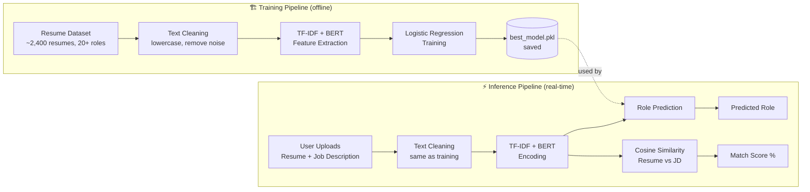

<div align="center">

# 🎯 AI Resume Analyzer & Job Matching System

### *Predict the right job role and match score from any resume — powered by hybrid NLP.*

A machine learning system that analyzes resumes, predicts the most suitable job role, and computes a semantic match score against any job description — combining keyword-based and meaning-based understanding for accurate, explainable results.

[](https://python.org)
[](https://fastapi.tiangolo.com)
[](https://scikit-learn.org)
[](https://www.sbert.net)
[](LICENSE)

---

**Built by [Rashmi Manani](https://github.com/rashmii2210)**

</div>

---

## 📋 Table of Contents

- [Problem Statement](#-problem-statement)
- [Features](#-features)
- [How It Works](#-how-it-works)
- [Results](#-results)
- [Tech Stack](#%EF%B8%8F-tech-stack)
- [Dataset](#-dataset)
- [Reproducing the Model](#-reproducing-the-model)
- [Project Structure](#-project-structure)
- [Usage](#-usage)
- [Limitations](#%EF%B8%8F-limitations)
- [Contributing](#-contributing)
- [References](#-references)
- [License](#-license)

---

## 🧩 Problem Statement

Manual resume screening is slow and error-prone:

- Recruiters review **thousands of resumes** for every open role
- Simple keyword-matching systems **miss context and meaning**
- Candidates rarely get useful feedback on how well they fit a role

**This system automates the process** using a hybrid NLP pipeline that understands both *keywords* and *semantic meaning*, giving recruiters and candidates a fast, accurate role prediction and match score.

---

## ✨ Features

| Feature | Description |
|---------|-------------|
| 🎯 **Role Prediction** | Predicts the most suitable job role from resume text using a trained ML classifier |
| 📊 **Match Score** | Computes a 0–100% semantic similarity score between a resume and a job description |
| 🔍 **Hybrid NLP** | Combines TF-IDF (keyword importance) with BERT embeddings (semantic meaning) |
| ⚡ **Real-time API** | FastAPI backend serves predictions instantly via a single `/analyze` endpoint |
| 🖥️ **Simple UI** | Upload a resume, paste a job description, get results instantly |

---

## 🧠 How It Works

The system has two pipelines: an **offline training pipeline** (run once to build the model) and an **online inference pipeline** (runs on every user request).



**Pipeline breakdown:**

1. **Data Collection** — ~2,400 labeled resumes across 20+ job categories (Kaggle dataset)
2. **Text Cleaning** — lowercase conversion, URL/symbol removal, whitespace normalization
3. **Feature Extraction**
   - **TF-IDF** — captures keyword importance (1–3 word n-grams, ~3,000 features)
   - **BERT** (`all-MiniLM-L6-v2`) — captures semantic meaning (384-dim vector)
4. **Feature Combination** — TF-IDF + BERT vectors merged into a single feature representation
5. **Model Training** — Logistic Regression classifier trained on combined features
6. **Resume–Job Matching** — cosine similarity between resume and job description BERT embeddings, converted to a 0–100% match score
7. **API Layer** — FastAPI `/analyze` endpoint returns predicted role + match score in JSON

---

## 📈 Results

| Metric | Score |
|--------|-------|
| **Accuracy (TF-IDF + BERT hybrid)** | ~75–78% |
| TF-IDF only | Lower accuracy |
| BERT only | Moderate accuracy |
| **Combined (hybrid)** | **Highest accuracy** |

**Match score interpretation:**

| Score Range | Verdict |
|-------------|---------|
| 75%+ | ✅ Excellent Match |
| 60–75% | 🟢 Good Match |
| 45–60% | 🟡 Average Match |
| Below 45% | 🔴 Poor Match |

A confusion matrix (`confusion_matrix_final.png`) is generated during evaluation to visualize per-category performance and identify commonly confused roles (e.g., Data Analyst vs. Data Scientist).

---

## 🛠️ Tech Stack

| Layer | Technology |
|-------|-----------|
| Language | Python |
| ML / NLP | Scikit-learn (Logistic Regression, TF-IDF), Sentence Transformers (BERT) |
| PDF Parsing | pdfplumber |
| Data Processing | Pandas, NumPy, Regex |
| Visualization | Matplotlib, Seaborn |
| Backend | FastAPI, Uvicorn |
| Frontend | Self-contained HTML (inline CSS/JS) |
| Model Storage | Pickle (`.pkl`), NumPy (`.npy`) |

---

## 📦 Dataset

This project uses the [**Resume Dataset**](https://www.kaggle.com/datasets/snehaanbhawal/resume-dataset) by Snehaan Bhawal on Kaggle — ~2,400 resumes labeled across 24 job categories, with `ID`, `Resume_str`, `Resume_html`, and `Category` columns.

1. Download the dataset and place it at `data/Resume.csv`
2. Run `1_explore.py` to generate the cleaned version at `data/Resume_clean.csv`

---

## 🔁 Reproducing the Model

Model artifacts (`models/*.pkl`, `*.npy`) are not included in this repo due to file size. To regenerate them:

```bash
python 1_explore.py    # cleans data/Resume.csv → data/Resume_clean.csv
python 2_train.py      # trains model → saves to models/
python 3_evaluate.py   # evaluates model → generates confusion_matrix_final.png
```

---

## 📁 Project Structure

```
resume-ml/
├── 1_explore.py              # Data loading, cleaning, exploration
├── 2_train.py                 # Feature extraction + model training
├── 3_evaluate.py               # Model evaluation, confusion matrix
├── 4_predict.py                # Standalone role prediction testing
├── 5_matcher.py                 # Resume–job description matching logic
├── api.py                        # FastAPI backend (/analyze endpoint)
├── index.html                     # Self-contained frontend (HTML + inline CSS/JS)
├── requirements.txt                # Python dependencies
│
├── data/                              # git-ignored (see Dataset below)
│   ├── Resume.csv                        # Raw Kaggle dataset
│   └── Resume_clean.csv                  # Cleaned dataset (output of 1_explore.py)
│
└── models/                            # git-ignored (see Models below)
    ├── best_model.pkl                    # Trained Logistic Regression model
    ├── tfidf_vectorizer.pkl              # Fitted TF-IDF vectorizer
    ├── label_categories.pkl              # Job role label mapping
    ├── bert_embeddings.npy               # Cached BERT embeddings
    └── confusion_matrix_final.png        # Evaluation visualization
```

> **Note:** `data/` and `models/` are excluded from version control due to file size (dataset ~70MB, embeddings ~4.6MB). See [Dataset](#-dataset) and [Reproducing the Model](#-reproducing-the-model) below to regenerate them locally.

---

## 🚀 Usage

| Script | Purpose |
|--------|---------|
| `1_explore.py` | Loads raw dataset, removes invalid/missing rows, saves `Resume_clean.csv` |
| `2_train.py` | Extracts TF-IDF + BERT features, trains Logistic Regression, saves model artifacts |
| `3_evaluate.py` | Evaluates trained model — accuracy, classification report, confusion matrix |
| `4_predict.py` | Tests role prediction on sample resume text |
| `5_matcher.py` | Tests resume-to-job-description matching independently |
| `api.py` | Serves the full pipeline via a FastAPI `/analyze` endpoint |

### Run the training pipeline

```bash
python 1_explore.py
python 2_train.py
python 3_evaluate.py
```

### Test role prediction (`4_predict.py`)

```bash
# Predict from raw text
python 4_predict.py --text "Software engineer with 3 years of Python and machine learning experience..."

# Predict from a resume PDF (sample provided in samples/)
python 4_predict.py --pdf samples/sample_resume.pdf

# Run built-in demo (4 sample resumes across different roles)
python 4_predict.py --demo
```

**Sample output:**
```
=======================================================
  Resume
=======================================================
  Predicted Category : Information-Technology
  Confidence         : 87.32%

  Top 5 Possible Roles:
    1. Information-Technology      87.32%  █████████████████████
    2. Engineering                  6.14%  █
    3. Data-Science                 3.21%  
    ...
```

### Test resume–job matching (`5_matcher.py`)

```bash
# Match a resume against a job description (sample files provided in samples/)
python 5_matcher.py --resume samples/sample_resume.txt --job samples/sample_jd.txt

# Run built-in demo (6 resume/JD pairs across different match qualities)
python 5_matcher.py --demo
```

**Sample output:**
```
  Resume  : samples/sample_resume.txt
  Job     : samples/sample_jd.txt
  Score   : 82.4%  →  Excellent Match
  Verdict : Strong candidate for this role
```

### Start the API

```bash
uvicorn api:app --reload --port 8000
```

### Open the frontend

```bash
# index.html is self-contained — just open it directly in a browser
start index.html        # Windows
open index.html          # macOS
```

### Test the `/analyze` endpoint

The API supports both `.pdf` (extracted via `pdfplumber`) and `.txt` resume uploads.

```bash
curl -X POST http://localhost:8000/analyze \
  -F "resume=@samples/sample_resume.pdf" \
  -F "job_description=We are looking for a backend developer with Python and FastAPI experience..."
```

**Response:**
```json
{
  "predicted_role": "Backend Developer",
  "match_score": 82.4
}
```

---

## ⚠️ Limitations

- Accuracy depends on dataset quality and size
- Limited to predefined job categories from the training set
- BERT encoding adds computational overhead vs. TF-IDF alone
- No grammar/language correction on resume text
- Doesn't support multi-resume ranking for a single job posting
- Scanned/image-based PDFs with no extractable text will return an error (no OCR support)

---

## 🤝 Contributing

Contributions are welcome! Here's how to get started:

```bash
# Fork the repo, then:
git clone https://github.com/your-username/ai-resume-analyzer.git
cd ai-resume-analyzer
git checkout -b feature/your-feature-name

# Make your changes, then:
git commit -m "feat: add your feature"
git push origin feature/your-feature-name
# Open a Pull Request
```

**Ideas for contributions:**
- **Resume Improvement Generator** — AI-assisted resume rewriting suggestions
- **Skills Gap Analysis** — extract skills, compare against job requirements
- **ATS Resume Checker** — keyword density, formatting, section completeness validation
- **Resume Ranking System** — rank multiple candidates for a single role
- **Career Recommendation Engine** — suggest alternative roles based on skill profile
- **Interview Question Generator** — role-based question generation
- **Learning Recommendations** — course/resource suggestions for skill gaps
- **Grammar & Tone Checker** — language quality improvements
- **OCR Support** — extract text from scanned/image-based PDFs
- **Advanced Dashboard UI** — richer, more interactive frontend

If you're fixing a bug or adding a feature, please open an issue first to discuss the change — especially for anything that touches the training pipeline or model artifacts.

---

## 📚 References

- [Resume Dataset (Snehaan Bhawal)](https://www.kaggle.com/datasets/snehaanbhawal/resume-dataset) — Kaggle dataset used for training
- [Scikit-learn](https://scikit-learn.org) — ML models and TF-IDF
- [Sentence Transformers](https://www.sbert.net) — BERT embeddings
- [Hugging Face](https://huggingface.co) — pretrained models
- [FastAPI](https://fastapi.tiangolo.com) — backend framework
- [NumPy](https://numpy.org) · [Pandas](https://pandas.pydata.org) · [Matplotlib](https://matplotlib.org) · [Seaborn](https://seaborn.pydata.org)

---

<div align="center">

**Built by [Rashmi Manani](https://github.com/rashmii2210)**

⭐ Star this repo if you found it useful!

</div>